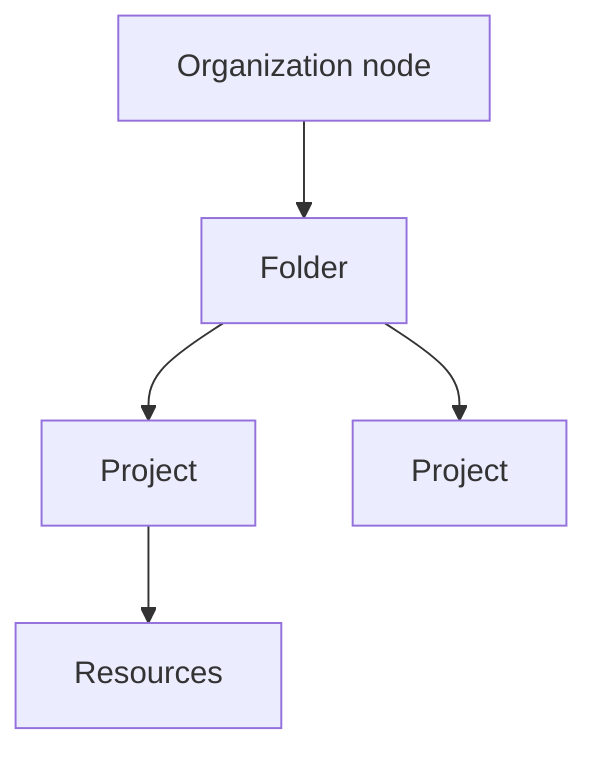

# Resources and Access in the Cloud

## Level 01 (Resources)
Resources are organized into projects and projects are organized into folder

policy can be defined in project, folder and organization node.
some policy can be defined in resource level as well.
policies are inherited downwards.

## Level 02 (Projects)
* managing apis
* enabling billing
* adding and removing collaboratoes
* enabling other google services
* 3 identifying attreibuted: ID, name, number
* Project ID: Globally unique; Assigned by google cloud but mutable during creation; immutable after creation
* Project name: Need not be unique, chosen by you, mutable
* Project number: Globally unique; Assigned by Google Cloud; Immutable -- use internally by Google cloud

Resource Manager Tool
* Gather a list of projects
* Create/update/delete/recover projects
* Access thru RPC API and REST API

## Level 03 (Folder)
* Folder can contain projects or other folders or both
* allow to group resource based on different org
* policy in folder can apply across all folders within that folder
  
## Level 04 (organization node)
* org policy admin
* project creator - who can create project
* Google workspace customer
* non-google workspace customer
